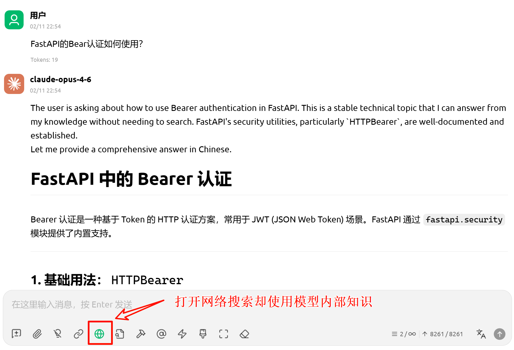
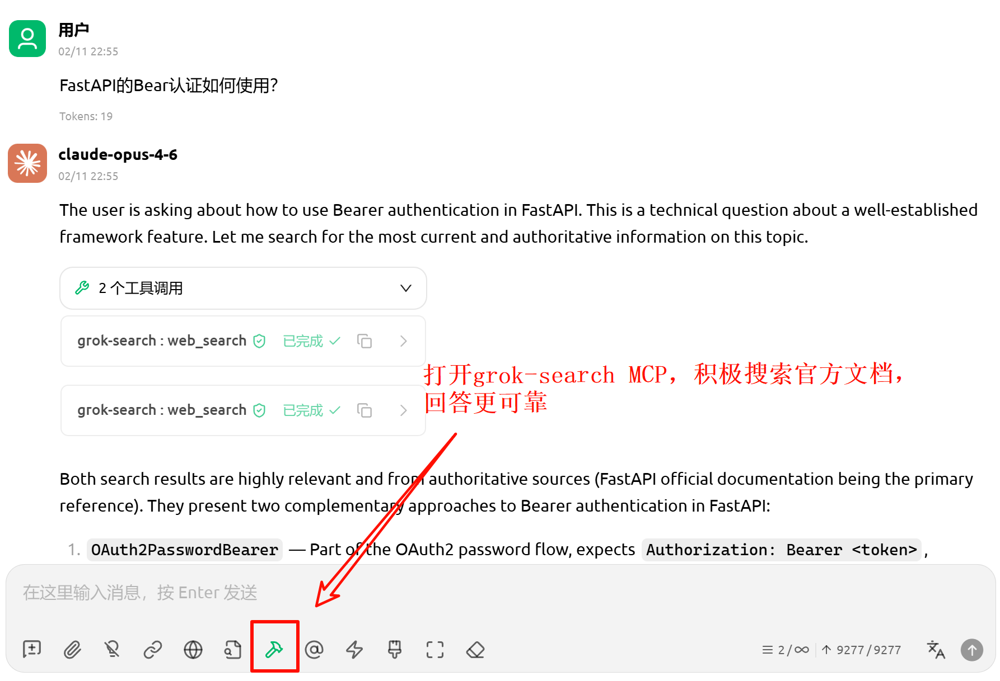

<div align="center">

<!-- # Grok Search MCP -->

[English](./docs/README_EN.md) | 简体中文

**Grok-with-Tavily MCP，为 Claude Code 提供更完善的网络访问能力**

[](https://opensource.org/licenses/MIT) [](https://www.python.org/downloads/) [](https://github.com/jlowin/fastmcp)

</div>

---

## 一、概述

Grok Search MCP 是一个基于 [FastMCP](https://github.com/jlowin/fastmcp) 构建的 MCP 服务器，采用**双引擎架构**：**Grok** 负责 AI 驱动的智能搜索，**Tavily** 负责高保真网页抓取与站点映射，各取所长为 Claude Code / Cherry Studio 等LLM Client提供完整的实时网络访问能力。

```
Claude ──MCP──► Grok Search Server
                  ├─ web_search  ───► Grok API（AI 搜索）
                  ├─ web_fetch   ───► Tavily Extract → Firecrawl Scrape（内容抓取，自动降级）
                  └─ web_map     ───► Tavily Map（站点映射）
```

### 功能特性

- **双引擎**：Grok 搜索 + Tavily 抓取/映射，互补协作
- **Firecrawl 托底**：Tavily 提取失败时自动降级到 Firecrawl Scrape，支持空内容自动重试
- **OpenAI 兼容接口**，支持任意 Grok 镜像站
- **自动时间注入**（检测时间相关查询，注入本地时间上下文）
- 一键禁用 Claude Code 官方 WebSearch/WebFetch，强制路由到本工具
- 智能重试（支持 Retry-After 头解析 + 指数退避）
- 父进程监控（Windows 下自动检测父进程退出，防止僵尸进程）

### 效果展示
我们以在`cherry studio`中配置本MCP为例，展示了`claude-opus-4.6`模型如何通过本项目实现外部知识搜集，降低幻觉率。

如上图，**为公平实验，我们打开了claude模型内置的搜索工具**，然而opus 4.6仍然相信自己的内部常识，不查询FastAPI的官方文档，以获取最新示例。

如上图，当打开`grok-search MCP`时，在相同的实验条件下，opus 4.6主动调用多次搜索，以**获取官方文档，回答更可靠。** 


## 二、安装

### 前置条件

- Python 3.10+
- [uv](https://docs.astral.sh/uv/getting-started/installation/)（推荐的 Python 包管理器）
- Claude Code

<details>
<summary><b>安装 uv</b></summary>

```bash
# Linux/macOS
curl -LsSf https://astral.sh/uv/install.sh | sh

# Windows PowerShell
powershell -ExecutionPolicy ByPass -c "irm https://astral.sh/uv/install.ps1 | iex"
```

> Windows 用户**强烈推荐**在 WSL 中运行本项目。

</details>

### 一键安装
若之前安装过本项目，使用以下命令卸载旧版MCP。
```
claude mcp remove grok-search
```


将以下命令中的环境变量替换为你自己的值后执行。Grok 接口需为 OpenAI 兼容格式；Tavily 为可选配置，未配置时工具 `web_fetch` 和 `web_map` 不可用。

#### 基础配置（至少一个 Grok Provider Profile）

至少配置一组完整的 Grok Provider Profile。下面示例只配置 FAST，也可以正常运行所有搜索模式：

```bash
claude mcp add-json grok-search --scope user '{
  "type": "stdio",
  "command": "uvx",
  "args": [
    "--from",
    "git+https://github.com/GuDaStudio/GrokSearch@grok-with-tavily",
    "grok-search"
  ],
  "env": {
    "GROK_PROVIDER_FAST_API_URL": "https://your-fast-provider.example/v1",
    "GROK_PROVIDER_FAST_API_KEY": "your-fast-provider-key",
    "GROK_PROVIDER_FAST_ENDPOINT": "chat/completions",
    "GROK_PROVIDER_FAST_MODEL": "grok-4.20-fast"
  }
}'
```

#### 自定义配置

如需使用自己的 API 端点，可分别配置各服务：

```bash
claude mcp add-json grok-search --scope user '{
  "type": "stdio",
  "command": "uvx",
  "args": [
    "--from",
    "git+https://github.com/GuDaStudio/GrokSearch@grok-with-tavily",
    "grok-search"
  ],
  "env": {
    "GROK_PROVIDER_FAST_API_URL": "https://your-fast-provider.example/v1",
    "GROK_PROVIDER_FAST_API_KEY": "your-fast-provider-key",
    "GROK_PROVIDER_FAST_ENDPOINT": "chat/completions",
    "GROK_PROVIDER_FAST_MODEL": "grok-4.20-fast",
    "TAVILY_API_KEY": "tvly-your-tavily-key",
    "TAVILY_API_URL": "https://api.tavily.com"
  }
}'
```

Provider Profile 配置模板（示例中的注释建议放在 README / 文档中，真实 `~/.codex/config.toml` 保持干净即可）：

```toml
# 快速搜索入口：适合日常搜索和低延迟任务
GROK_PROVIDER_FAST_API_URL = "https://your-fast-provider.example/v1"
GROK_PROVIDER_FAST_API_KEY = "sk-your-fast-key"
GROK_PROVIDER_FAST_ENDPOINT = "chat/completions"
GROK_PROVIDER_FAST_MODEL = "grok-4.20-fast"

# 深度搜索入口：适合复杂研究；可使用另一个服务商
GROK_PROVIDER_DEEP_API_URL = "https://your-deep-provider.example/v1"
GROK_PROVIDER_DEEP_API_KEY = "sk-your-deep-key"
GROK_PROVIDER_DEEP_ENDPOINT = "chat/completions"
GROK_PROVIDER_DEEP_MODEL = "grok-4.3-high"

# 默认搜索模式；auto 会根据问题复杂度和 extra_sources 做保守路由
GROK_SEARCH_MODE = "fast"

# 默认 false：缺少另一个 profile 时静默使用已配置 profile，不打扰用户
GROK_STRICT_SEARCH_MODE = "false"
```

<details> <summary>如果遇到 SSL / 证书验证错误</summary>

在部分企业网络或代理环境中，可能会出现类似错误：

certificate verify failed
self signed certificate in certificate chain

可以在 uvx 参数中添加 --native-tls，使其使用系统证书库：

claude mcp add-json grok-search --scope user '{
  "type": "stdio",
  "command": "uvx",
  "args": [
    "--native-tls",
    "--from",
    "git+https://github.com/GuDaStudio/GrokSearch@grok-with-tavily",
    "grok-search"
  ],
  "env": {
    "GROK_PROVIDER_FAST_API_URL": "https://your-fast-provider.example/v1",
    "GROK_PROVIDER_FAST_API_KEY": "your-fast-provider-key",
    "GROK_PROVIDER_FAST_ENDPOINT": "chat/completions",
    "GROK_PROVIDER_FAST_MODEL": "grok-4.20-fast"
  }
}'
</details> ```

除此之外，你还可以在`env`字段中配置更多环境变量

| 变量 | 必填 | 默认值 | 说明 |
|------|------|--------|------|
| `GUDA_API_KEY` | ❌ | - | GuDa API 密钥（用于未显式配置的 Tavily / Firecrawl 派生值） |
| `GUDA_BASE_URL` | ❌ | `https://code.guda.studio` | GuDa 服务基础地址 |
| `GROK_PROVIDER_FAST_API_URL` | ⚠️ | - | fast profile 的 OpenAI 兼容 API 地址 |
| `GROK_PROVIDER_FAST_API_KEY` | ⚠️ | - | fast profile 的 API Key |
| `GROK_PROVIDER_FAST_ENDPOINT` | ❌ | `chat/completions` | fast profile 请求端点，可设为 `chat/completions` 或 `responses` |
| `GROK_PROVIDER_FAST_MODEL` | ⚠️ | - | fast profile 使用的 Grok 模型 |
| `GROK_PROVIDER_DEEP_API_URL` | ⚠️ | - | deep profile 的 OpenAI 兼容 API 地址 |
| `GROK_PROVIDER_DEEP_API_KEY` | ⚠️ | - | deep profile 的 API Key |
| `GROK_PROVIDER_DEEP_ENDPOINT` | ❌ | `chat/completions` | deep profile 请求端点，可设为 `chat/completions` 或 `responses` |
| `GROK_PROVIDER_DEEP_MODEL` | ⚠️ | - | deep profile 使用的 Grok 模型 |
| `GROK_SEARCH_MODE` | ❌ | `fast` | 默认搜索模式。可设为 `fast`、`deep` 或 `auto` |
| `GROK_STRICT_SEARCH_MODE` | ❌ | `false` | 是否严格要求请求的 profile 必须存在 |
| `TAVILY_API_KEY` | ❌ | `{GUDA_API_KEY}` | Tavily API 密钥（用于 web_fetch / web_map） |
| `TAVILY_API_URL` | ❌ | `{GUDA_BASE_URL}/tavily` | Tavily API 地址 |
| `TAVILY_ENABLED` | ❌ | `true` | 是否启用 Tavily |
| `FIRECRAWL_API_KEY` | ❌ | `{GUDA_API_KEY}` | Firecrawl API 密钥（Tavily 失败时托底） |
| `FIRECRAWL_API_URL` | ❌ | `{GUDA_BASE_URL}/firecrawl` | Firecrawl API 地址 |
| `GROK_DEBUG` | ❌ | `false` | 调试模式 |
| `GROK_LOG_LEVEL` | ❌ | `INFO` | 日志级别 |
| `GROK_LOG_DIR` | ❌ | `logs` | 日志目录 |
| `GROK_RETRY_MAX_ATTEMPTS` | ❌ | `3` | 最大重试次数 |
| `GROK_RETRY_MULTIPLIER` | ❌ | `1` | 重试退避乘数 |
| `GROK_RETRY_MAX_WAIT` | ❌ | `10` | 重试最大等待秒数 |

> **注意**：至少配置一组完整的 `GROK_PROVIDER_FAST_*` 或 `GROK_PROVIDER_DEEP_*`，Grok 搜索即可运行。只配置一组 profile 时，所有搜索模式都会使用这组可用配置，且不会产生用户可见 warning。


### 验证安装

```bash
claude mcp list
```

🍟 显示连接成功后，我们**十分推荐**在 Claude 对话中输入 
```
调用 grok-search toggle_builtin_tools，关闭Claude Code's built-in WebSearch and WebFetch tools
```
工具将自动修改**项目级** `.claude/settings.json` 的 `permissions.deny`，一键禁用 Claude Code 官方的 WebSearch 和 WebFetch，从而迫使claude code调用本项目实现搜索！


## 三、MCP 工具介绍

<details>
<summary>本项目提供的主要 MCP 工具（展开查看）</summary>

### `web_search` — AI 网络搜索

通过 Grok API 执行 AI 驱动的网络搜索，默认仅返回 Grok 的回答正文，并返回 `session_id` 以便后续获取信源。

`web_search` 输出不展开信源，仅返回 `sources_count`；信源会按 `session_id` 缓存在服务端，可用 `get_sources` 拉取。

| 参数 | 类型 | 必填 | 默认值 | 说明 |
|------|------|------|--------|------|
| `query` | string | ✅ | - | 搜索查询语句 |
| `platform` | string | ❌ | `""` | 聚焦平台（如 `"Twitter"`, `"GitHub, Reddit"`） |
| `search_mode` | string | ❌ | `""` | Grok 模型路由模式。空值使用 `GROK_SEARCH_MODE`；支持 `fast`、`deep`、`auto` |
| `extra_sources` | int | ❌ | `1` | 额外补充信源数量（Tavily/Firecrawl，可为 0 关闭） |

自动检测查询中的时间相关关键词（如"最新""今天""recent"等），注入本地时间上下文以提升时效性搜索的准确度。

返回值（结构化字典）：
- `session_id`: 本次查询的会话 ID
- `content`: Grok 回答正文（已自动剥离信源）
- `sources_count`: 已缓存的信源数量
- `warnings`: 当 Grok 返回为空或不可用时给出诊断提示
- `provider_profile_requested`: 本次任务请求的 Grok profile
- `provider_profile_used`: 本次任务实际使用的 Grok profile
- `provider_profile_reason`: 实际路由原因
- `model_used`: 本次 Grok 搜索实际使用的模型
- `endpoint_used`: 本次 Grok 搜索实际使用的 endpoint
- `search_mode_effective`: 本次实际生效的搜索模式

当 Grok 主搜索返回为空但 Tavily/Firecrawl 仍提供补充信源时，`content` 会以“注意：Grok 主搜索返回为空……”开头，并建议运行 `diagnose_grok_config` 检查 Provider Profile 配置。

### `get_sources` — 获取信源

通过 `session_id` 获取对应 `web_search` 的全部信源。

| 参数 | 类型 | 必填 | 说明 |
|------|------|------|------|
| `session_id` | string | ✅ | `web_search` 返回的 `session_id` |

返回值（结构化字典）：
- `session_id`
- `sources_count`
- `sources`: 信源列表（每项包含 `url`，可能包含 `title`/`description`/`provider`）

### `web_fetch` — 网页内容抓取

通过 Tavily Extract API 获取完整网页内容，返回 Markdown 格式。Tavily 失败时自动降级到 Firecrawl Scrape 进行托底抓取。

| 参数 | 类型 | 必填 | 说明 |
|------|------|------|------|
| `url` | string | ✅ | 目标网页 URL |

### `web_map` — 站点结构映射

通过 Tavily Map API 遍历网站结构，发现 URL 并生成站点地图。

| 参数 | 类型 | 必填 | 默认值 | 说明 |
|------|------|------|--------|------|
| `url` | string | ✅ | - | 起始 URL |
| `instructions` | string | ❌ | `""` | 自然语言过滤指令 |
| `max_depth` | int | ❌ | `1` | 最大遍历深度（1-5） |
| `max_breadth` | int | ❌ | `20` | 每页最大跟踪链接数（1-500） |
| `limit` | int | ❌ | `50` | 总链接处理数上限（1-500） |
| `timeout` | int | ❌ | `150` | 超时秒数（10-150） |

### `get_config_info` — 配置信息

无需参数。显示当前配置摘要与 Provider Profile 状态（API Key 自动脱敏）。联网诊断请使用 `diagnose_grok_config`。

### `diagnose_grok_config` — Grok 连接诊断

用于更深入排查 Grok 主搜索为空、endpoint 不兼容、模型不存在或 URL 缺少 `/v1` 的情况。该工具会按 Provider Profile 分组测试 `/models`、`chat/completions` 和 `responses`，并返回 profile 级建议。API Key 会自动脱敏。

| 参数 | 类型 | 必填 | 默认值 | 说明 |
|------|------|------|--------|------|
| `profile` | string | ❌ | `""` | 指定 `fast` 或 `deep`；空值检测全部已填写 profile |

### `switch_model` — 已废弃

| 参数 | 类型 | 必填 | 说明 |
|------|------|------|------|
| `model` | string | ✅ | 已忽略。模型需配置到 `GROK_PROVIDER_FAST_MODEL` 或 `GROK_PROVIDER_DEEP_MODEL` |

Grok 模型现在绑定到 Provider Profile。该工具保留是为了给旧调用返回明确的废弃提示。

### `toggle_builtin_tools` — 工具路由控制

| 参数 | 类型 | 必填 | 默认值 | 说明 |
|------|------|------|--------|------|
| `action` | string | ❌ | `"status"` | `"on"` 禁用官方工具 / `"off"` 启用官方工具 / `"status"` 查看状态 |

修改项目级 `.claude/settings.json` 的 `permissions.deny`，一键禁用 Claude Code 官方的 WebSearch 和 WebFetch。

### `search_planning` — 搜索规划

结构化搜索规划脚手架（分阶段、多轮），用于在执行复杂搜索前先生成可执行的搜索计划。
</details>

## 四、常见问题

<details>
<summary>
Q: 必须同时配置 Grok 和 Tavily 吗？
</summary>
A: Grok 至少需要一组完整的 Provider Profile（FAST 或 DEEP 任意一组）。Tavily 和 Firecrawl 均为可选：配置 Tavily 后 `web_fetch` 优先使用 Tavily Extract，失败时降级到 Firecrawl Scrape；两者均未配置时 `web_fetch` 将返回配置错误提示。`web_map` 依赖 Tavily。
</details>

<details>
<summary>
Q: 只配置 FAST 或只配置 DEEP 会不会每次都 warning？
</summary>
A: 不会。缺少另一个 profile 是正常状态，不是失败。默认 `GROK_STRICT_SEARCH_MODE=false` 时，MCP 会使用唯一可用的 profile，并只在结构化字段中记录实际路由。只有 API 失败、模型不存在、endpoint 不兼容、Grok 返回空等真实故障才会进入用户可见 warning。
</details>

<details>
<summary>
Q: Grok API 地址需要什么格式？
</summary>
A: 需要 OpenAI 兼容格式的 API 地址（支持 `/chat/completions` 和 `/models` 端点）。如使用官方 Grok，需通过兼容 OpenAI 格式的镜像站访问。
</details>

<details>
<summary>
Q: 如何验证配置？
</summary>
A: 使用 `get_config_info` 查看脱敏配置摘要；使用 `diagnose_grok_config` 进行联网诊断，检查每个 Provider Profile 的 URL、Key、模型和 endpoint。
</details>

## 许可证

[MIT License](LICENSE)

---

<div align="center">

**如果这个项目对您有帮助，请给个 Star！**

[](https://www.star-history.com/#GuDaStudio/GrokSearch&type=date&legend=top-left)
</div>
